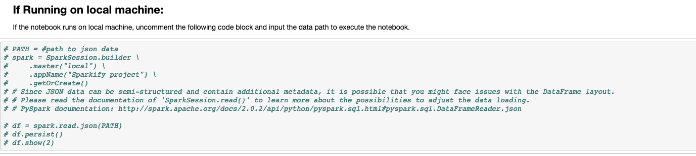
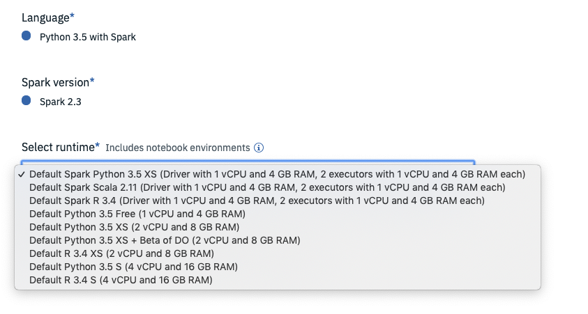

# SparkML-Churn-Prediction
Customer churn prediction using spark MLlib with large-scale dataset.

## Motivation
Customer churn rate prediction is a very challenging problem and it’s also a very common task that data scientists and analysts regularly encounter in any customer-facing business. In this project, we aim to predict customer-churn behaviour with large-scale dataset using Spark machine learning libraries.

## Tools and platforms:
* Python (3.5)
* Spark (2.3.2)
* Cloud Computing platform : AWS EMR, S3 and IBM watson Studio

## Libraries:
* spark MLlib
* spark ml
* spark sql

## Usage:
Souce code is contained in a notebook file that locates in src folder. There are two options to run this notebook:

#### Run on local machine:
You should set up the python and spark environment correspondingly. Then uncomment the following code block to run:
 

#### Run on cloud platform:
IBM watson studio is free to use. You can sign up an account and upload this notebook to run. In the project setup page, be sure to select environment with python (>=3.5) and spark (>=2.3).
 

## Results:
The dataset is highly imbalanced and several metrics are evaluated in this project. With recall = 1, we successfully predicted all customers that will churn their services. With the improvement of feature extraction and upper-sampling procedures, we can expect a further improvement of precision and f1_score.

* precision =  0.05947955390334572
* recall =  1.0
* f1_score =  0.11228070175438597
* accuracy =  0.8473495187473065

## Useful links
* [result on IBM Studio](https://dataplatform.cloud.ibm.com/analytics/notebooks/v2/81597f8f-8bea-4bef-98c1-9dc1cc2e594c/view?access_token=c6de2f2300a97ba59bd2ebd4a657b22ff92dc84117b133c95c8c06659cfebc99)

* [Blog](https://medium.com/@lihaoyu001/customer-churn-prediction-using-spark-mllib-with-large-scale-dataset-7292c55cc43d) - A blog to describe this prediction.
